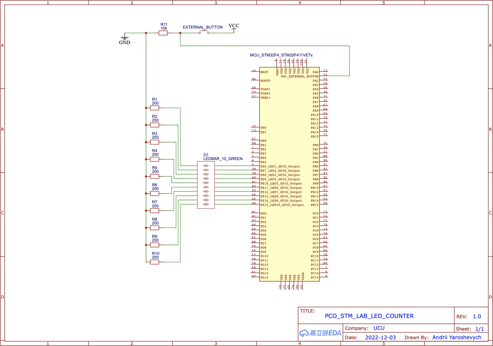

# Lab 5. STM32 Discovery Kit

> Team members: Andrii Yaroshevych, Pavlo Kryven

## Prerequisites

### Hardware

- [Discovery Kit with STM32F411VE MCU](https://www.st.com/en/evaluation-tools/32f411ediscovery.html)

### Software

- [STM32CubeIDE](https://www.st.com/en/development-tools/stm32cubeide.html) version 1.11.0 is highly recommended
> **Note**
> 
> You can use any other IDE, but you will need to configure it manually.

## Compilation and Flashing
To compile the project in case of using other IDE, you will need to use the GNU Arm Embedded Toolchain. You can download it from [here](https://developer.arm.com/tools-and-software/open-source-software/developer-tools/gnu-toolchain/gnu-rm/downloads)

If you are using STM32CubeIDE, you can use the following steps to compile and flash the project after opening it:

1. Select the project in the Project Explorer
2. Right-click on the project and select `Build Project`
3. Right-click on the project and select `Run As` -> `1 STM32 C/C++ Application`

### Installation

Clone the repository to your local machine using the following command:

```bash
$ mkdir ~/workspace
$ cd ~/workspace
$ git clone https://github.com/ucu-cs/stm32_5-1-kryven_yaroshevych
```

and open the project in STM32CubeIDE.

### Usage

Connect the Discovery Kit to your PC using the USB cable and flash the project to the board as described in paragraph [Compilation and Flashing](#compilation-and-flashing)

### Task 1. Led carousel

After flashing the project, the LEDs on the board will start to blink in a carousel fashion. The direction of the carousel can be changed by pressing the `User` button on the board.

> **Note**
> 
> You can adjust the speed of the carousel by changing the value of the `PWM_DELAY` constant in the `main.c` file.

#### Demonstration

// Add a video here

### Task 2. Led counter

To complete this task, you will need to assemble the circuit shown below:



After flashing the project, the LEDs on the external LED bar will represent the number of times an external button was pressed in binary format.

As additional functionality, if you hold the external button for `500ms` counter will automatically increment by `1` every `100ms`.
> **Note**
> 
> This delays, respectively, can be adjusted by changing the values of the `HOLD_DELAY` and `AUTO_COUNT_DELAY` constants in the `main.c` file.

To reset the counter, you can press the `RESET` button on the board.

#### Demonstration

// Add a video here

## Additional tasks

* All tasks were implemented using Interrupts
* Led carousel supports PWM


## Configuration

// TODO


## License
The [MIT](https://choosealicense.com/licenses/mit/) License (MIT)

Copyright © 2022. Andrii Yaroshevych, Pavlo Kryven
