# Lab 5. STM32 Discovery Kit

> Team members: Andrii Yaroshevych, Pavlo Kryven
> 
> Board: STM32F411E-DISCO

## Prerequisites

### Hardware

- [Discovery Kit with STM32F411VE MCU](https://www.st.com/en/evaluation-tools/32f411ediscovery.html)

### Software

- [STM32CubeIDE](https://www.st.com/en/development-tools/stm32cubeide.html) version 1.11.0 is highly recommended
> **Note**
> 
> You can use any other IDE, but you will need to configure it manually.

## Compilation and Flashing
To compile the project in case of using other IDE, you will need to use the GNU Arm Embedded Toolchain. You can download it from [here](https://developer.arm.com/tools-and-software/open-source-software/developer-tools/gnu-toolchain/gnu-rm/downloads)

If you are using STM32CubeIDE, you can use the following steps to compile and flash the project after opening it:

1. Select the project in the Project Explorer
2. Right-click on the project and select `Build Project`
3. Right-click on the project and select `Run As` -> `1 STM32 C/C++ Application`

### Installation

Clone the repository to your local machine using the following command:

```bash
$ mkdir ~/workspace
$ cd ~/workspace
$ git clone https://github.com/ucu-cs/stm32_5-1-kryven_yaroshevych
```

and open the project in STM32CubeIDE.

### Usage

Connect the Discovery Kit to your PC using the USB cable and flash the project to the board as described in paragraph [Compilation and Flashing](#compilation-and-flashing)

### Task 1. Led carousel

After flashing the project, the LEDs on the board will start to blink in a carousel fashion. The direction of the carousel can be changed by pressing the `User` button on the board.

> **Note**
> 
> You can adjust the speed of the carousel by changing the value of the `PWM_DELAY` constant in the `main.c` file.

#### Demonstration


### Task 2. Led counter

To complete this task, you will need to assemble the circuit shown below:


For better quality, you can see the [pdf version](./schematics/led_counter_schematic.pdf) of the schematic.

After flashing the project, the LEDs on the external LED bar will represent the number of times an external button was pressed in binary format.

As additional functionality, if you hold the external button for `500ms` counter will automatically increment by `1` every `100ms`.
> **Note**
> 
> This delays, respectively, can be adjusted by changing the values of the `HOLD_DELAY` and `AUTO_COUNT_DELAY` constants in the `main.c` file.

To reset the counter, you can press the `RESET` button on the board.

#### Demonstration

Basic functionality:


Auto count functionality demonstration:


## Additional tasks

### Led carousel
* Task 1: Use PWM to control LED brightness
* Task 2: Implement by relying on interrupts

### Led counter
* Task 1: Implement by relying on interrupts


## Configuration

The project was configured using the STM32CubeMX. 
The configuration files can be found in the project directories - `led_carousel/led_carousel.ioc` and `led_counter/led_counter.ioc`.

Steps to configure the project using STM32CubeMX:

### Led carousel

1. Open STM32CubeMX
2. Open the `.ioc` configuration file
3. For internal LED pins (`PD12` - `PD15`) select `TIM4_CHx` mode:
    - `PD12` - `TIM4_CH1`
    - `PD13` - `TIM4_CH2`
    - `PD14` - `TIM4_CH3`
    - `PD15` - `TIM4_CH4`

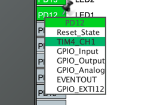

4. Go to the `Pinout & Configuration` tab and select `TIM4` in the `Timers` section:

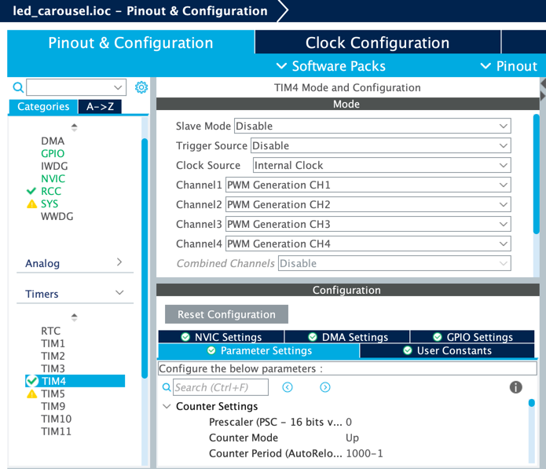

Set all the channels to `PWM Generation` mode and select `Internal Clock` as the clock source.

Also, set the `Counter Period` value to `1000-1`:

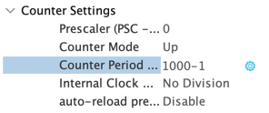

These steps are required to configure the PWM for the internal LEDs.

5. On the `Pinout & Configuration` tab, add user labels to the LED pins and User button:
   - `LED1` - `PD12`
   - `LED2` - `PD13`
   - `LED3` - `PD14`
   - `LED4` - `PD15`
   - `PUSH_BUTTON` - `PA0_WKUP`
   

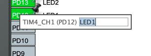


6. Go to the `System Core` tab and select `NVIC` section:

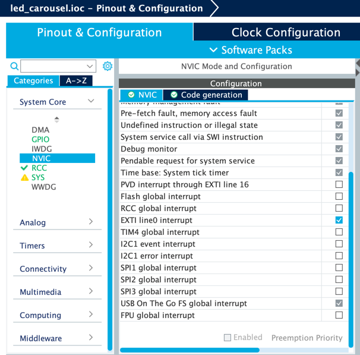

allow the `EXTI line0 interrupt` to make the `User` button work.

Go to the `GPIO` tab and select the `PA0_WKUP` pin:

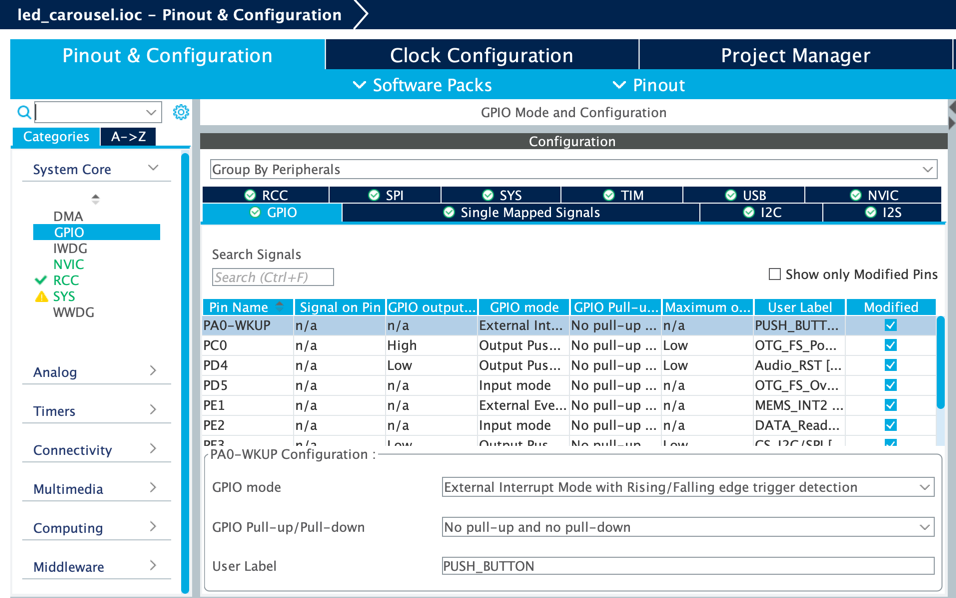

set the `GPIO mode` mode to `External Interrupt with Rising/Falling edge trigger detection`

7. Go to the `System Core` tab and select `RCC` section:

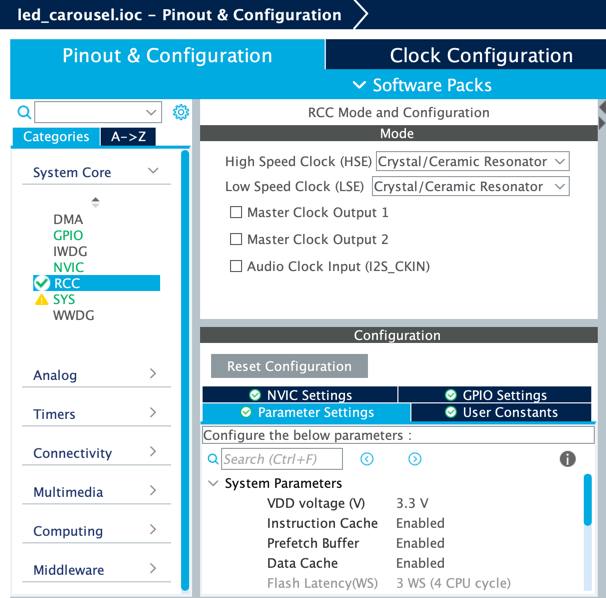

Set both `HSE` and `LSE` to `Crystal/Ceramic Resonator`.

Finally, generate the code and open the project in STM32CubeIDE.

### Led counter

1. In STM32CubeMX, open the `.ioc` configuration file
2. For external LED pins (`PE6` - `PE15`) select `GPIO_Output` mode on the `Pinout & Configuration` tab:

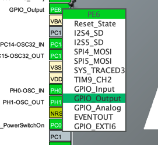

3. For external button pin (`PA1`) select `GPIO_EXTI1` mode:

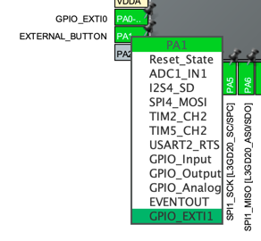

also, give it a user label `EXTERNAL_BUTTON`.

4. Go to the `System Core` tab and select `NVIC` section:

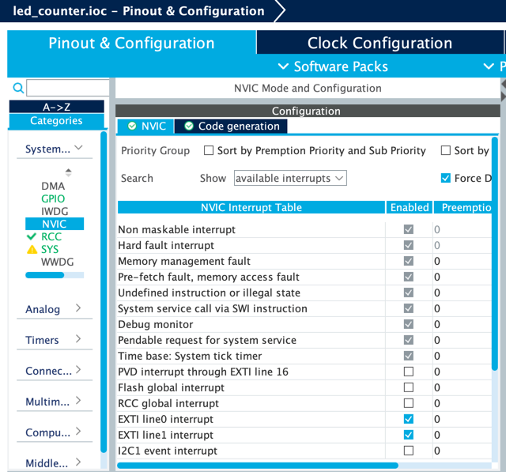

allow the `EXTI line1 interrupt` to make the external button work.

Go to the `GPIO` tab and select the `PA1` pin:

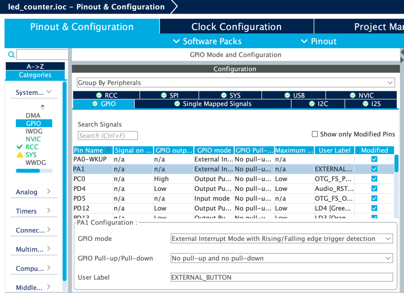

set the `GPIO mode` mode to `External Interrupt with Rising/Falling edge trigger detection`

5. Go to the `System Core` tab and select `RCC` section:

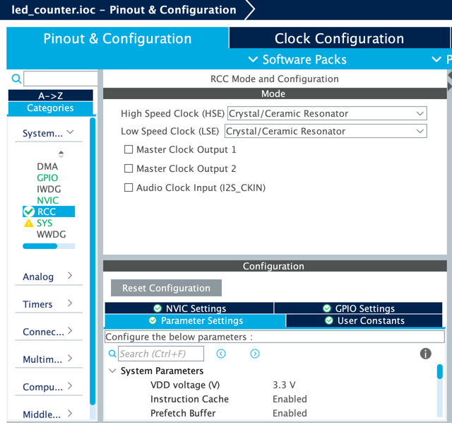

Set both `HSE` and `LSE` to `Crystal/Ceramic Resonator`.

Finally, generate the code and open the project in STM32CubeIDE.

## License
The [MIT](https://choosealicense.com/licenses/mit/) License (MIT)

Copyright © 2022. Andrii Yaroshevych, Pavlo Kryven
